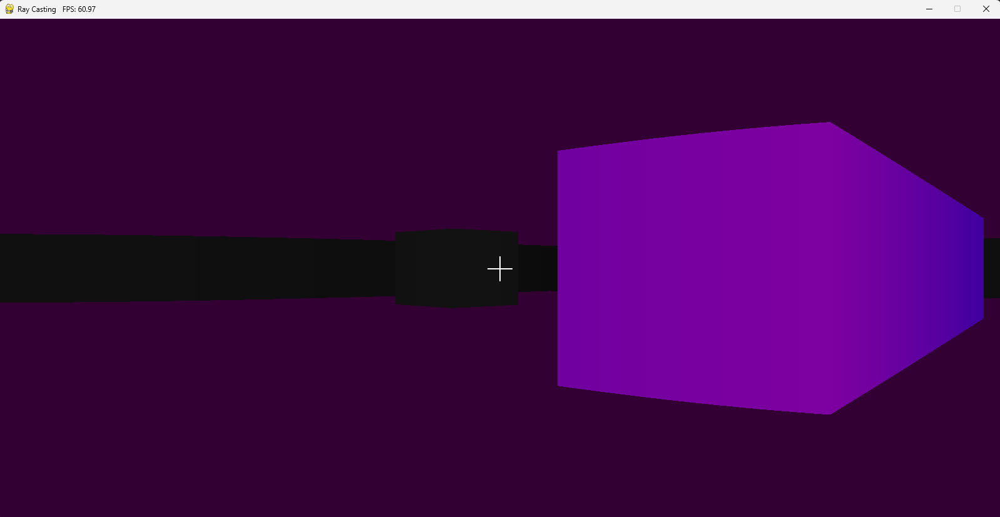
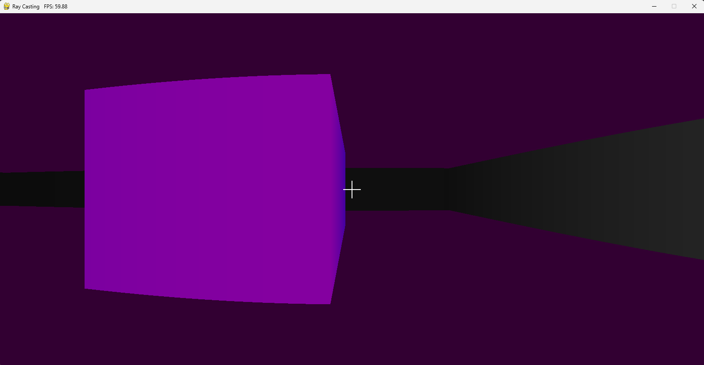

# Program Description

This program aims create a seemingly 3D environment just with the use of a 2D environment along with distance and angle measurements from rays shot out from the player character

WASD moves forward, left, backwards and right respectively  
The left and right arrow keys turn the camera one eighth of a rotation in either direction

By default this program will shoot out 1600 rays from the player character each frame and have them colide with an object in the environment which will then paint a one pixel wide vertical line on the screen with a height that varies on the objects distance, doing this all across the screen gives the illusion of 3 dimensionality

# Important Variables:

**tiles**: The 2D array housing the tiles

**rays**: The amount of rays shot out each frame, note that by default the program window is 1600 pixels wide so making it larger will not have an effect

**fov:** The field of view of the player, note that angles are measure from 0 to (pi * 100)

# Screenshots:

